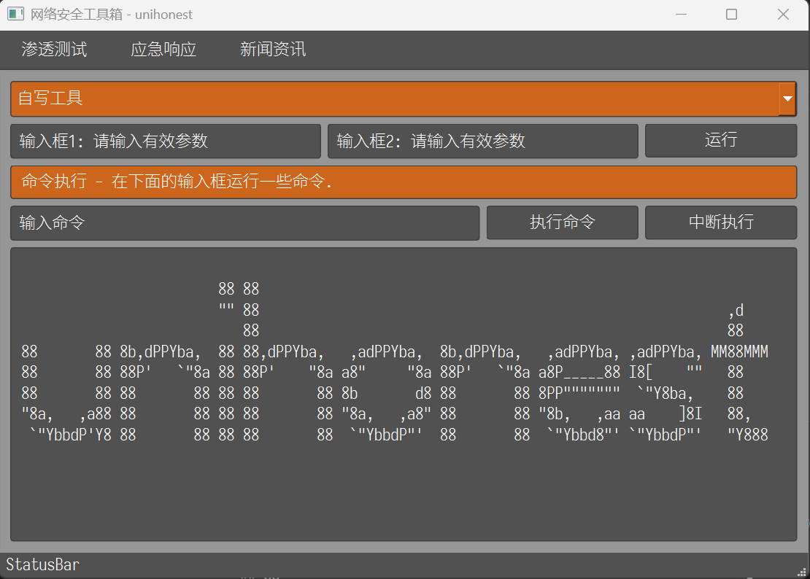

# UnihonestToolbox

## 描述

图形化界面。（功能还未完善）

## 安装

建议在虚拟环境下使用，如：conda create -n unihonest python=3.12.7

1. `git clone https://github.com/unihonest/UnihonestToolbox.git`
2. `python -V`
3. `pip -V`
4. `pip install -r requirements.txt -i https://mirrors.ustc.edu.cn/pypi/simple`
5. `python MainWindow.py`

## 界面

## 其他工具使用

1. `pip install -r .\其他工具目录\requirements.txt -i https://mirrors.ustc.edu.cn/pypi/simple`
2. 在 Command 功能处，运行命令，如：`python ..`
